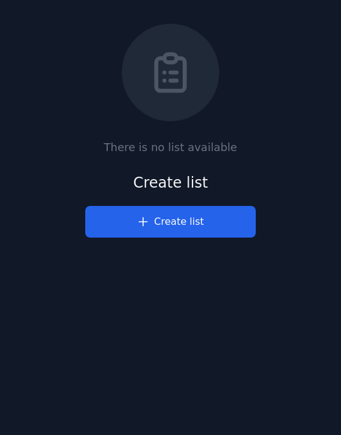
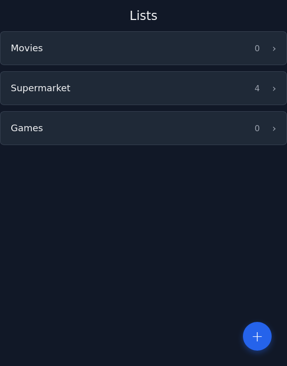
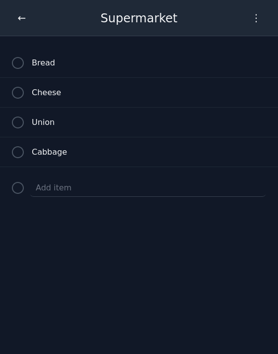

# yala

A tiny, mobile-first shared list application.

yala is a simple, single global list app with a mobile-focused UI. It stores the list as JSON, hides completed items when requested, and automatically syncs between connected clients. There are no user accounts and no built-in security — everyone shares the same global list.





## Application
- Mobile-first UI designed for quick entry and fast interaction on phones.
- Single shared list accessible by any client connected to the same server/instance.
- Changes appear automatically across other clients (automatic sync).

## Key features
- UI focus on mobile: compact layout, large touch targets, and quick-add input for one-handed use.
- List stored in JSON format: easy to export, inspect, or integrate with other tools.
- Hide done items: toggle to hide completed tasks and keep the list focused.
- Automatic sync between clients: updates propagate to other open clients so everyone sees the latest list.
- No accounts: there is no login or per-user data — the app operates on a single shared list.
- No built-in security: the app does not implement authentication or encryption; run it only where this is acceptable.
- One global list: no multiple lists or per-user lists — a single authoritative list for all clients.

## JSON list format (example)
```json
{
  "supermarket": {
    "name": "Supermarket",
    "items": [
      {
        "name": "Bread",
        "completed": false
      },
      {
        "name": "Cheese",
        "completed": false
      },
      {
        "name": "Onion",
        "completed": false
      },
      {
        "name": "Cabbage",
        "completed": false
      }
    ],
    "show_completed": true
  },
  "movies": {
    "name": "Movies",
    "items": [],
    "show_completed": true
  },
  "games": {
    "name": "Games",
    "items": [],
    "show_completed": true
  }
}
```

## Security & privacy
- There are no accounts and no built-in access controls.
- The app does not encrypt data or restrict who can read or modify the list.
- Do not store sensitive or private information in this list.
- If you need private lists or authentication, add a secure layer (authentication, HTTPS, access controls) in front of the app.

## Running
- The repository contains a web application (static or server-backed depending on implementation).
- To try it locally, serve the project files (for example, using a static server) or follow the project's existing dev/start instructions if present.
- Remember: because there's no built-in security, only run it in trusted environments or behind appropriate access controls.

## Contributing
Contributions and improvements are welcome. Please open issues or PRs with suggested changes.

## License
Add a LICENSE file or specify the project's license (e.g., MIT).